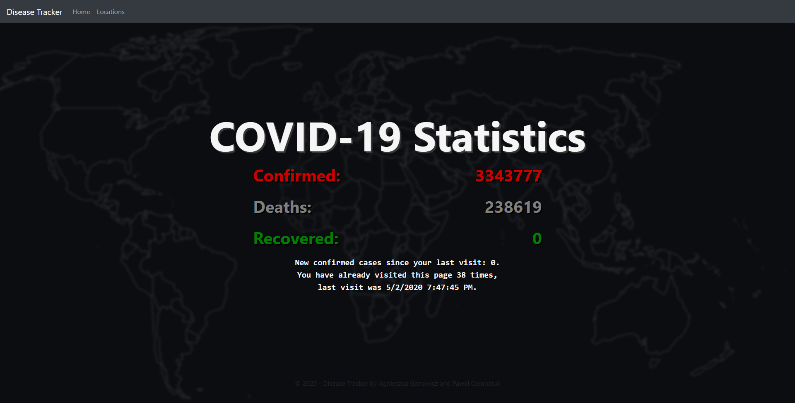
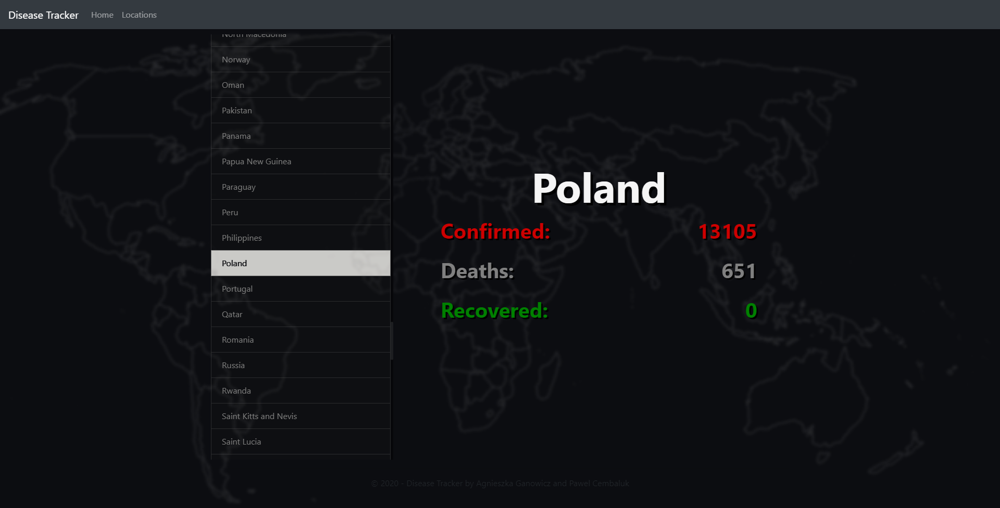
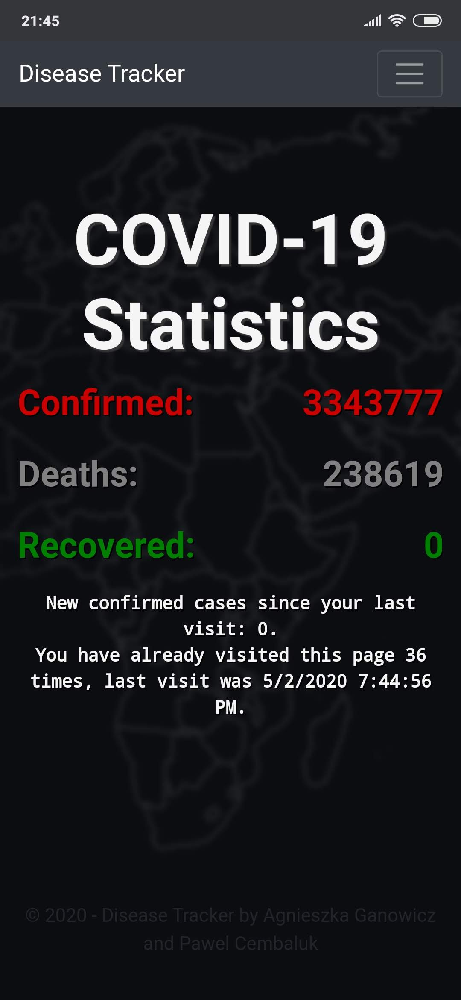
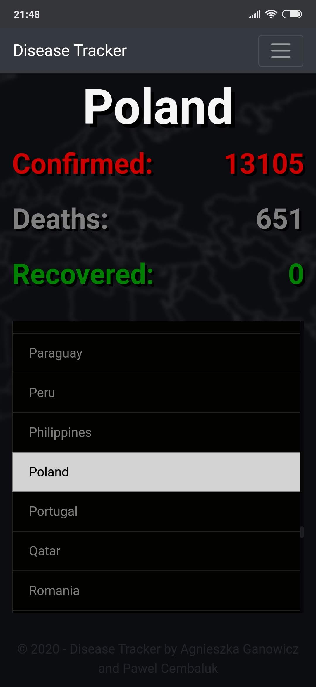

# Programming platforms .NET and Java
.NET and Java course projects. The .Net project is revolved around displaying COVID-19 statistics. 

Check it out on Azure!\
https://diseasetracker.azurewebsites.net/

Main features:
* Fetching data from REST API [Coronavirus Tracker API](https://github.com/ExpDev07/coronavirus-tracker-api).
* Displaying statistics for all countries.
* Storing information about visitors in MS SQL Server.

## Authors
* **Agnieszka Ganowicz**
* **Pawel Cembaluk**

Favicon made by Vitaly Gorbachev from www.flaticon.com.

## Built with
* [JetBrains Rider](https://www.jetbrains.com/rider/)
* [ASP.NET MVC](https://dotnet.microsoft.com/apps/aspnet/mvc)
* [Entity Framework](https://docs.microsoft.com/en-us/ef/)
* [Bootstrap](https://getbootstrap.com/)
* [NUnit](https://nunit.org/)
* [Moq](https://github.com/moq/moq4)
* [Unity MVC](https://github.com/unitycontainer/aspnet-mvc)
* [log4net](https://logging.apache.org/log4net/)
* [Sourcetree](https://www.sourcetreeapp.com/)

## Screenshots

|  |  |
|:------------------------------------:|:---------------------------------:|
|  |  |

